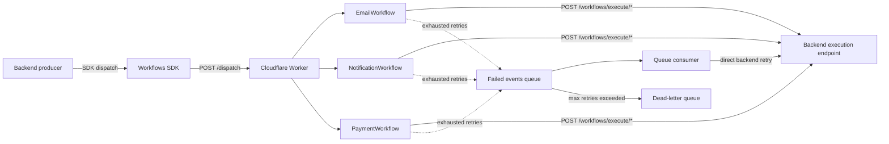

# Workflows Worker

Cloudflare Worker + Cloudflare Workflows runtime used by Manhali to execute background jobs reliably.

This package is the workflow runtime for the monorepo. It receives typed events from `@abshahin/workflows-sdk`, starts the correct workflow class, calls the backend internal execution endpoints, and recovers permanently failed jobs through Cloudflare Queues.

Related SDK: `https://github.com/aashahin/workflows-sdk`

## What this service does

- Accepts authenticated event batches at `POST /dispatch`
- Routes events to workflow classes by event domain
- Supports delayed execution with `step.sleep(...)`
- Retries transient backend failures inside the workflow runtime
- Pushes exhausted workflow failures into a retry queue
- Re-dispatches failed events from a queue consumer with progressive backoff
- Exposes minimal health and operational endpoints

## Event domains

The worker currently handles three workflow domains:

- Email workflows
- Notification workflows
- Payment workflows

Bindings are configured in `wrangler.toml`:

- `EMAIL_WORKFLOW`
- `NOTIFICATION_WORKFLOW`
- `PAYMENT_WORKFLOW`

## Architecture

The full system is split across three layers.

### 1. Producer layer: backend + SDK

- The backend creates workflow jobs through `@abshahin/workflows-sdk` (`https://github.com/aashahin/workflows-sdk`)
- The SDK sends event batches over HTTP to this worker's `/dispatch` endpoint
- Event contracts are shared and typed across producer and runtime

### 2. Runtime layer: this worker

- Validates incoming payloads
- Authenticates requests with a bearer token
- Applies lightweight per-isolate rate limiting
- Resolves each event to a workflow binding
- Starts a Cloudflare Workflow instance per event

### 3. Execution layer: backend callback

- Each workflow calls the backend internal endpoint at `POST /workflows/execute/:path`
- The backend restores tenant context when relevant
- Existing domain services execute the actual side effects
- The backend uses an execution log to avoid duplicate side effects when retries happen

## End-to-end flow

1. Backend code creates a job through the SDK.
2. The SDK sends an authenticated `POST /dispatch` request.
3. This worker validates the batch and starts the matching workflow.
4. The workflow optionally delays execution.
5. The workflow calls the backend callback endpoint.
6. Cloudflare Workflows retries transient step failures.
7. If the workflow still fails, the event is persisted to Cloudflare Queues for delayed recovery.
8. The queue consumer retries the backend call directly until success or dead-lettering.

## Architecture diagram



## Repository layout

```text
src/
  env.ts                     Typed Cloudflare bindings
  index.ts                   HTTP entrypoint + queue consumer
  lib/
    backend.ts               Backend callback helpers
    failed-events.ts         Queue persistence + retry processing
  workflows/
    email.workflow.ts        Email workflow implementation
    notification.workflow.ts Notification workflow implementation
    payment.workflow.ts      Payment workflow implementation
```

## HTTP API

### `POST /dispatch`

Starts workflow instances for a batch of events.

Authentication:

- `Authorization: Bearer <AUTH_TOKEN>`

Behavior:

- Rejects payloads larger than 1 MB
- Requires a JSON body with an `events` array
- Validates the basic event structure before workflow creation
- Returns created workflow IDs plus per-item errors for rejected events

Example request:

```json
{
  "events": [
    {
      "id": "evt_01",
      "idempotencyKey": "email:reset-password:user-42",
      "traceId": "trace_01",
      "delayMs": 0,
      "event": {
        "name": "email/reset-password",
        "data": {
          "tenantId": "tenant_123",
          "email": "user@example.com",
          "otpCode": "123456"
        }
      }
    }
  ]
}
```

Example response:

```json
{
  "ids": ["evt_01"]
}
```

Example `curl` command:

```bash
curl -X POST "$WORKER_URL/dispatch" \
  -H "Authorization: Bearer $AUTH_TOKEN" \
  -H "Content-Type: application/json" \
  -d '{
    "events": [
      {
        "id": "evt_demo_01",
        "idempotencyKey": "demo:email:reset-password:user-42",
        "traceId": "trace_demo_01",
        "delayMs": 0,
        "event": {
          "name": "email/reset-password",
          "data": {
            "tenantId": "tenant_123",
            "email": "user@example.com",
            "userName": "John Doe",
            "otpCode": "123456"
          }
        }
      }
    ]
  }'
```

Partial-failure response shape:

```json
{
  "ids": ["evt_01"],
  "errors": [
    {
      "id": "evt_02",
      "error": "Unknown event: something/unsupported"
    }
  ]
}
```

### `GET /health`

Simple liveness endpoint.

Example response:

```json
{
  "status": "ok"
}
```

Example `curl` command:

```bash
curl "$WORKER_URL/health"
```

### `GET /failed-events`

Authenticated operational endpoint that exposes queue names used for retry + dead-letter processing.

Authentication:

- `Authorization: Bearer <AUTH_TOKEN>`

Example `curl` command:

```bash
curl "$WORKER_URL/failed-events" \
  -H "Authorization: Bearer $AUTH_TOKEN"
```

## Workflow behavior

Each workflow follows the same high-level pattern:

1. Accept event payload from `/dispatch`
2. Optionally sleep for `delayMs`
3. Call the backend execution path through `step.do(...)`
4. Retry transient failures with Cloudflare Workflows retry policy
5. Persist exhausted failures to a queue unless the error is non-retryable

### Step retry policy

The workflow step retry policy is:

- Retry limit: `3`
- Initial delay: `1 second`
- Backoff: `exponential`

This retry layer is separate from the queue-based failed-event recovery.

### Backend callback behavior

All workflow classes call the backend through shared helpers in `src/lib/backend.ts`.

The worker forwards these headers when available:

- `Authorization: Bearer <AUTH_TOKEN>`
- `X-Trace-Id`
- `X-Workflow-Event-Id`
- `x-tenant-id` when `tenantId` exists in the payload

Non-retryable backend statuses are currently:

- `404`
- `409`
- `422`

Other failures remain retryable, including:

- `400`
- `401`
- `403`
- `429`
- all `5xx` responses

## Failed-event recovery

When a workflow exhausts its internal retries, the worker stores the event in `FAILED_EVENTS_QUEUE`.

### Why Queues are used

Cloudflare Queues give the worker a better recovery path than ad hoc storage-based retry loops:

- Native delayed retries
- Automatic message delivery to the consumer
- Built-in dead-letter queue support
- No polling cron required
- No custom visibility timeout bookkeeping

### Queue flow

1. The workflow stores the failed event in `manhali-failed-events`.
2. The first queue delivery is delayed by 60 seconds.
3. The queue consumer calls the backend directly.
4. On success, the message is acknowledged.
5. On retryable failure, the message is requeued with a progressive delay.
6. After `max_retries`, Cloudflare moves the message to `manhali-failed-events-dlq`.

### Retry schedule

Current delay schedule implemented in `src/lib/failed-events.ts`:

- `1m`
- `5m`
- `15m`
- `30m`
- `45m`
- `60m`
- `90m`
- `120m`

The consumer is configured with `max_retries = 10`, so later attempts use the final capped delay value.

### Queue consumer settings

From `wrangler.toml`:

- `max_retries = 10`
- `dead_letter_queue = "manhali-failed-events-dlq"`
- `max_batch_size = 10`
- `max_batch_timeout = 30`

## Event catalog

### Email events

- `email/reset-password`
- `email/new-account-credentials`
- `email/change-email-verification`
- `email/verification`
- `email/cart-recovery`
- `email/invitation`
- `email/enrollment-confirmation`
- `email/trial-reminder`

### Notification events

- `notification/create`
- `notification/bulk-create`

### Payment events

- `payment/process-payout`

The payment workflow currently orchestrates payout processing in three backend steps:

1. Validate payout
2. Process payout
3. Notify payout status

## Security model

The worker intentionally keeps its trust model simple:

- Shared bearer token between the backend and the worker
- Constant-time token comparison to reduce timing attack leakage
- Input shape validation at the dispatch boundary
- Lightweight in-memory rate limiting on `/dispatch`

Important limitation:

- The rate limiter is per isolate, not global. It helps contain accidental or abusive loops but is not a substitute for a distributed rate-limiting layer.

## Observability

The worker currently provides lightweight observability primitives:

- Structured console logging for dispatch, retry, and failure paths
- Trace propagation using `X-Trace-Id`
- Queue / DLQ visibility through Cloudflare dashboard metrics
- Operational endpoint at `/failed-events`

For production use, add external alerting around DLQ growth and repeated backend callback failures.

## Local development

### Prerequisites

- Bun
- Cloudflare account + Wrangler access
- The monorepo dependencies installed
- A reachable backend instance for workflow callback execution

### Install dependencies

From the repository root:

```bash
bun install
```

### Configure local secrets

Create `apps/workers/workflows-worker/.dev.vars` with:

```dotenv
AUTH_TOKEN=replace-with-a-shared-secret
BACKEND_URL=http://localhost:<backend-port>
```

The `ENVIRONMENT` variable is already defined in `wrangler.toml` for local development.

### Run locally

From this package directory:

```bash
bun run dev
```

Default local port:

```text
8787
```

### Useful commands

```bash
bun run dev
bun run deploy
bun run tail
```

## Deployment

Before deploying:

1. Provision the Cloudflare Workflows and Queue resources referenced by `wrangler.toml`.
2. Set the required worker secrets.
3. Make sure the backend exposes the internal callback routes.
4. Verify the worker and backend share the same `AUTH_TOKEN`.
5. Confirm the backend URL is reachable from the worker environment.

Set secrets with Wrangler:

```bash
wrangler secret put AUTH_TOKEN
wrangler secret put BACKEND_URL
```

Deploy:

```bash
bun run deploy
```

## Required configuration

### Worker secrets

- `AUTH_TOKEN`
- `BACKEND_URL`

### Worker vars

- `ENVIRONMENT`

### Related backend env

- `WORKFLOWS_WORKER_URL`
- `WORKFLOWS_AUTH_TOKEN`

## Relationship to the rest of the monorepo

- `apps/backend` produces and executes the business operations
- `packages/workflows-sdk` defines the client and event contracts
- This package provides the Cloudflare runtime and recovery layer

This separation keeps event production, orchestration, and business execution decoupled.

## Operational notes

- Deterministic idempotency keys are not used as Cloudflare Workflow instance IDs because completed instance IDs remain reserved.
- Queue retries call the backend directly instead of creating a new workflow instance so Cloudflare Queue attempt counters drive the backoff correctly.
- The backend is responsible for final side-effect idempotency through execution logging.

## Contributing

If you want to extend the worker, keep changes aligned with these conventions:

- Add new event contracts in `@abshahin/workflows-sdk` first
- Update worker routing in `src/index.ts`
- Implement the workflow in `src/workflows/`
- Keep backend execution endpoints explicit and idempotent
- Treat `404`, `409`, and `422` as permanently broken inputs unless the backend contract changes

If you add a new workflow domain, update this README's event catalog and operational notes in the same change.

## License

MIT. Add the `LICENSE` file in the published `cloudflare-workflows-worker` repository.
