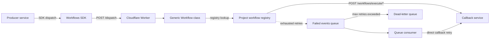

# Cloudflare Workflows Worker

Reusable Cloudflare Worker runtime for dispatching SDK workflow envelopes into Cloudflare Workflows.

This package is intended to be adapted per project. It exposes a small authenticated HTTP dispatcher, starts Cloudflare Workflow instances from `@abshahin/workflows-sdk` envelopes, calls a project callback service for side effects, and retries exhausted callback steps through Cloudflare Queues.

Related SDK: `https://github.com/aashahin/workflows-sdk`

## What This Worker Provides

- `POST /dispatch` for authenticated workflow batches
- `GET /status/:id?name=<workflowName>` for Workflow instance status
- `GET /health` for liveness checks
- Optional per-isolate rate limiting and request-size checks through the SDK dispatcher
- One generic Cloudflare Workflow class backed by an SDK workflow registry
- Queue-based recovery for callback steps that keep failing after Workflow retries

## Expected Project Wiring

To use this worker in your own project, provide:

- an SDK workflow registry package
- one Cloudflare Workflow binding in `wrangler.jsonc`
- a callback service reachable through `BACKEND_URL`
- a shared bearer token in `AUTH_TOKEN`
- a Cloudflare Queue and DLQ for failed callback retries

The default source in this repository is an example integration. Before publishing or reusing it as a template, replace project-specific registry imports, workflow class names, routes, queue names, and package dependencies with names for your own project.

## Architecture


```mermaid
flowchart LR
  A[Producer service] -->|SDK dispatch| B[Workflows SDK]
  B -->|POST /dispatch| C[Cloudflare Worker]
  C --> D[Generic Workflow class]
  D -->|registry lookup| E[Project workflow registry]
  E -->|POST /workflows/execute/*| F[Callback service]
  E -. exhausted retries .-> G[Failed events queue]
  G --> H[Queue consumer]
  H -->|direct callback retry| F
  G -->|max retries exceeded| I[Dead-letter queue]
```

## Repository Layout

```text
src/
  env.ts                     Typed Cloudflare bindings
  index.ts                   HTTP entrypoint, Workflow class, queue consumer
  lib/
    backend.ts               Callback service helper
    failed-events.ts         Queue persistence + retry processing
```

## HTTP API

### `POST /dispatch`

Starts Workflow instances for a batch of SDK envelopes.

Authentication:

- `Authorization: Bearer <AUTH_TOKEN>`

Behavior:

- Rejects payloads larger than 1 MB
- Requires `{ "events": WorkflowEventEnvelope[] }`
- Creates Cloudflare Workflow instances in batches when the binding supports `createBatch`
- Returns created instance IDs plus per-item errors for rejected events

Example request:

```json
{
  "events": [
    {
      "id": "evt_01",
      "idempotencyKey": "email:reset-password:user-42",
      "traceId": "trace_01",
      "name": "email/reset-password",
      "payload": {
        "tenantId": "tenant_123",
        "email": "user@example.com",
        "otpCode": "123456"
      },
      "createdAt": "2026-05-24T09:00:00.000Z"
    }
  ]
}
```

Example response:

```json
{
  "ids": ["evt_01"],
  "instances": [
    {
      "id": "evt_01",
      "name": "email/reset-password",
      "status": "queued"
    }
  ]
}
```

### `GET /status/:id`

Returns normalized Workflow status. Include `name=<workflowName>` when you know the workflow name; otherwise the dispatcher searches the configured registry bindings.

```bash
curl "$WORKER_URL/status/evt_01?name=email/reset-password" \
  -H "Authorization: Bearer $AUTH_TOKEN"
```

### `GET /health`

Simple liveness endpoint.

```json
{
  "status": "ok"
}
```

### `GET /failed-events`

Authenticated operational endpoint that identifies the retry and dead-letter queues configured for this worker.

```bash
curl "$WORKER_URL/failed-events" \
  -H "Authorization: Bearer $AUTH_TOKEN"
```

## Workflow Behavior

Project workflow definitions run through `createCloudflareWorkflowEntrypoint()` from `@abshahin/workflows-sdk/cloudflare`.

The runner maps:

- `ctx.step()` to Cloudflare `step.do()`
- `ctx.sleep()` to Cloudflare `step.sleep()` or `step.sleepUntil()`
- workflow retry/timeout defaults to Cloudflare step config
- `ctx.services` to project runtime services created from Worker env bindings

Delayed envelopes use `scheduledAt` or `delayMs`; the Workflow sleeps before executing user code.

## Callback Service

The example runtime calls:

```text
POST {BACKEND_URL}/workflows/execute/:path
```

Headers forwarded to the callback service:

- `Authorization: Bearer <AUTH_TOKEN>`
- `X-Trace-Id`
- `X-Workflow-Event-Id`
- `x-tenant-id` when `tenantId` exists in the payload

Permanent callback failures should return client statuses such as `400`, `404`, `409`, or `422`. Transient failures should use `429` or `5xx` so Workflow and queue retries can continue.

## Failed-Event Recovery

When a callback step still fails after Workflow retries, the runtime sends a failed-event message to `FAILED_EVENTS_QUEUE`.

Queue recovery flow:

1. A failed callback event is sent to the retry queue with a delay.
2. The queue consumer calls the callback service directly.
3. On success, the message is acknowledged. Multi-step workflows may include
   remaining callback steps so recovery can continue the original sequence.
4. On retryable failure, the message is requeued with progressive delay.
5. After `max_retries`, Cloudflare moves the message to the DLQ configured in `wrangler.jsonc`.

The consumer accepts both the current generic failed-event shape and the earlier `eventName`/`data` shape to make deploy rollouts safer.

## Local Development

Install dependencies:

```bash
bun install
```

Create `.dev.vars` in this package directory:

```dotenv
AUTH_TOKEN=replace-with-a-shared-secret
BACKEND_URL=http://localhost:<callback-service-port>
```

Run locally:

```bash
bun run dev
```

Default local port:

```text
8787
```

## Deployment

Before deploying:

1. Configure `wrangler.jsonc` with your route, Workflow binding, Queue, and DLQ names.
2. Set `AUTH_TOKEN` and `BACKEND_URL` with Wrangler secrets.
3. Make sure your callback service exposes the execution endpoint expected by your workflow definitions.
4. Confirm the callback service is reachable from Cloudflare Workers.

Set secrets:

```bash
wrangler secret put AUTH_TOKEN
wrangler secret put BACKEND_URL
```

Deploy:

```bash
bun run deploy
```

## Required Configuration

Worker secrets:

- `AUTH_TOKEN`
- `BACKEND_URL`

Worker vars:

- `ENVIRONMENT`

Producer service env:

- `WORKFLOWS_WORKER_URL`
- `WORKFLOWS_AUTH_TOKEN`

## Customization Checklist

When adapting this worker:

- Replace the example project registry import with your own registry package.
- Replace the example Workflow class name and `wrangler.jsonc` `class_name` if desired.
- Replace route, Workflow, Queue, and DLQ names in `wrangler.jsonc`.
- Keep workflow step names stable once deployed because Cloudflare uses them for durable step state.
- Keep callback execution idempotent by using `X-Workflow-Event-Id`.
- Add alerting around DLQ growth and repeated callback failures.

## Verification

Useful checks:

```bash
bunx tsc --noEmit -p tsconfig.json
```

## License

MIT.
