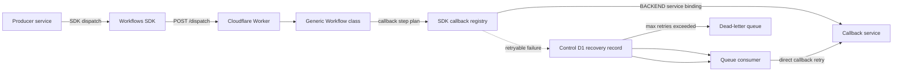

# Cloudflare Workflows Worker

Reusable Cloudflare Worker runtime for dispatching SDK workflow envelopes into Cloudflare Workflows.

This package is intended to be adapted per project. It exposes a small authenticated HTTP dispatcher, starts Cloudflare Workflow instances from `@abshahin/workflows-sdk` envelopes, calls a project callback service through a private service binding, and gives Cloudflare Queues sole ownership of callback retries.

Related SDK: `https://github.com/aashahin/workflows-sdk`

## What This Worker Provides

- `POST /dispatch` for authenticated workflow batches
- `GET /status/:id?name=<workflowName>` for Workflow instance status
- `GET /health` for liveness checks
- Optional per-isolate rate limiting and request-size checks through the SDK dispatcher
- One generic Cloudflare Workflow class backed by the SDK callback registry
- Queue-based recovery for callback steps without layered Workflow retries

## Expected Project Wiring

To use this worker in your own project, provide:

- one Cloudflare Workflow binding in `wrangler.jsonc`
- the `workflow_dispatch_receipts` migration applied to the configured control D1
- a required private `BACKEND` service binding
- a shared bearer token in `AUTH_TOKEN`
- a Cloudflare Queue and DLQ for failed callback retries

The default source is project-agnostic. Before publishing or reusing it as a template, replace route, Workflow, Queue, and DLQ names in `wrangler.jsonc` with names for your own project.

## Architecture


```mermaid
flowchart LR
  A[Producer service] -->|SDK dispatch| B[Workflows SDK]
  B -->|POST /dispatch| C[Cloudflare Worker]
  C --> D[Generic Workflow class]
  D -->|callback step plan| E[SDK callback registry]
  E -->|BACKEND service binding| F[Callback service]
  E -. retryable failure .-> G[Control D1 recovery record]
  G --> H[Opaque record ID on failed-events Queue]
  G --> H[Queue consumer]
  H -->|direct callback retry| F
  G -->|max retries exceeded| I[Dead-letter queue]
```

## Repository Layout

```text
src/
  env.ts                     Typed Cloudflare bindings
  index.ts                   HTTP entrypoint, Workflow class, queue consumer
  lib/
    backend.ts               Callback service helper
    failed-events.ts         Queue persistence + retry processing
```

## HTTP API

### `POST /dispatch`

Starts Workflow instances for a batch of SDK envelopes.

Authentication:

- `Authorization: Bearer <AUTH_TOKEN>`

Behavior:

- Rejects payloads larger than 1 MB
- Requires `{ "events": WorkflowEventEnvelope[] }`
- Creates Cloudflare Workflow instances in batches when the binding supports `createBatch`
- Returns created instance IDs plus per-item errors for rejected events

Example request:

```json
{
  "events": [
    {
      "id": "evt_01",
      "idempotencyKey": "course:rebuild-index:course-42",
      "traceId": "trace_01",
      "name": "course/rebuild-index",
      "payload": {
        "tenantId": "tenant_123",
        "courseId": "course_42"
      },
      "createdAt": "2026-05-24T09:00:00.000Z"
    }
  ]
}
```

Example response:

```json
{
  "ids": ["evt_01"],
  "instances": [
    {
      "id": "evt_01",
      "name": "course/rebuild-index",
      "status": "queued"
    }
  ]
}
```

### `GET /status/:id`

Returns normalized Workflow status. Include `name=<workflowName>` because the callback registry accepts dynamic signed workflow names.

```bash
curl "$WORKER_URL/status/evt_01?name=course/rebuild-index" \
  -H "Authorization: Bearer $AUTH_TOKEN"
```

### `GET /health`

Simple liveness endpoint.

```json
{
  "status": "ok"
}
```

### `GET /failed-events`

Authenticated operational endpoint that identifies the retry and dead-letter queues configured for this worker.

```bash
curl "$WORKER_URL/failed-events" \
  -H "Authorization: Bearer $AUTH_TOKEN"
```

## Workflow Behavior

Backend callback workflows run through `createCloudflareWorkflowEntrypoint()` from `@abshahin/workflows-sdk/cloudflare` and `createBackendCallbackWorkflowRegistry()` from `@abshahin/workflows-sdk`.

The runner maps:

- `ctx.step()` to Cloudflare `step.do()`
- `ctx.sleep()` to Cloudflare `step.sleep()` or `step.sleepUntil()`
- workflow retry/timeout defaults to Cloudflare step config
- `ctx.services` to backend callback services created from Worker env bindings

By default, the backend path equals the workflow name. Only
`payment/process-payout` may provide `metadata.callbackSteps`, and it must use
the exact three-step validate/process/notify plan:

```json
{
  "metadata": {
    "callbackSteps": [
      {
        "stepName": "validate-payout",
        "backendPath": "payment/validate-payout",
        "backendEventIdSuffix": "validate-payout"
      },
      {
        "stepName": "process-payout",
        "backendPath": "payment/process-payout",
        "backendEventIdSuffix": "process-payout"
      },
      {
        "stepName": "notify-payout-status",
        "backendPath": "payment/notify-payout-status",
        "backendEventIdSuffix": "notify-payout-status"
      }
    ]
  }
}
```

Delayed envelopes use `scheduledAt` or `delayMs`; the Workflow sleeps before executing user code.

Each dispatch request is capped at 100 events (one Cloudflare `createBatch`)
in addition to the 1 MiB request limit. Split larger producer batches so one
authenticated request cannot amplify into an unbounded number of instances.

Dispatch identity is persisted in control D1 before a Workflow create. Receipts
key the concrete Workflow binding name and instance ID to a canonical envelope
hash, and use a fenced five-minute creation lease. Exact retries can therefore
recover a committed create through the explicitly named binding, while a
different envelope for the same ID is rejected. Receipts expire after 31 days.
A dedicated five-minute maintenance trigger checks at most 12 candidates per
invocation (two pages of six), deferring temporarily busy rows for six hours
instead of hot-looping them. Apply
`migrations/20260827_0001_workflow_dispatch_receipts.sql` before deploying a version that
enables receipt-backed dispatch.

Worker-native notification producers use `notify-q` for single-side-effect jobs.
The generic callback admits the remaining email and notification producers plus
the payout orchestration. WhatsApp is rejected before instance creation while
its Worker-native provider sender remains intentionally unavailable.

## Callback Service

The runtime calls through the required `BACKEND` service binding:

```text
POST {BACKEND_ORIGIN}/workflows/execute/:path
```

The URL carries the API Worker's allowed public authority, but the request is
still transported privately by `env.BACKEND.fetch()`; it does not traverse the
public Internet.

Headers forwarded to the callback service:

- `Authorization: Bearer <BACKEND_CALLBACK_TOKEN>`
- `X-Trace-Id`
- `X-Workflow-Event-Id`
- `x-tenant-id` when `tenantId` exists in the payload

Permanent callback failures should return client statuses including `400`,
`401`, `403`, `404`, `409`, `413`, or `422`. Auth failures require an explicit
token-overlap/deploy procedure; retrying billed callbacks cannot repair a
mismatched credential. `408`, `425`, `429`, and `5xx` remain retryable. Each
callback has a 15-second abort deadline, and error response bodies are read and
logged only up to a bounded sanitized prefix.

## Failed-Event Recovery

When a callback step fails retryably, the runtime stores a bounded recovery
record in the existing control D1 `workflow_failed_events` table and sends only
its opaque ID to `FAILED_EVENTS_QUEUE`. This follows the project's “IDs, not
payloads-of-record” Queue rule, avoids duplicating OTP/PII-bearing payloads in
Queue storage, and does not retain every successful Workflow output just for
recovery.

Apply both Worker migrations before deploying the corresponding code:

1. `migrations/20260827_0001_workflow_dispatch_receipts.sql`
2. `migrations/20260827_0002_failed_event_queue_receipts.sql`

The failed-event migration is also required before deploying the backend manual
replay change. Manual replay updates the failed row and its Queue receipt in one
atomic D1 batch; if the receipt table is missing, the whole batch rolls back
instead of reopening and stranding the row.

Queue recovery flow:

1. The recovery row is created once. Exact duplicates validate the canonical
   envelope and preserve `PROCESSING`, `COMPLETED`, and `DEAD`; a conflicting
   envelope is rejected.
2. A `RETRY` enqueue receipt is created before publishing. Its owner token,
   monotonic fence, and 16-minute lease allow only one live Worker invocation
   to send. A rejected send records durable exponential backoff (five minutes
   through six hours). An accepted send with an ambiguous confirmation is
   repaired only after the lease expires.
3. A bounded 15-minute sweep discovers at most 10 callback rows missing a
   receipt and attempts at most 25 due sends. Confirmed retry pointers are
   refreshed once every three days, before Cloudflare Queue's default four-day
   retention. Receipts expire after 31 days; terminal or missing receipts are
   removed after a one-day grace period. Every sweep drains at most four indexed
   pages of 100 rows for each cleanup category and stops on the first short
   page, giving cleanup a hard per-invocation bound without allowing sustained
   receipt volume above 100/day to accumulate indefinitely.
4. The consumer atomically claims the row with its own 16-minute owner lease.
   Only a successful claim increments the durable processing attempt;
   duplicate or not-yet-due physical deliveries do not consume attempts or call
   the backend.
5. On retryable failure, `next_retry_at` and Queue retry-not-before metadata
   advance together. Physical Queue attempt counts never decide durable
   exhaustion. A nearly exhausted physical delivery may roll over one fresh
   pointer per durable processing attempt through the same enqueue receipt.
6. On success, the fenced D1 row is completed before the message is
   acknowledged. Multi-step workflows may include remaining callback steps so
   recovery can continue the original sequence.
7. Permanent or durably exhausted rows transition to `DEAD`. A separate `DLQ`
   receipt normally publishes one opaque pointer per terminal cycle (with one
   possible fenced repair duplicate after an ambiguous confirmation). Manual
   replay clears that receipt so a later terminal cycle can be reported once.

Rows with `metadata.recoveryOwner="callback-queue"` are explicitly excluded
from the backend's generic stale reset and retry dispatch queries. The Queue and
its enqueue receipt are the sole automatic retry owner, so recovery never
redispatches the original Workflow instance ID with a different envelope.
Admin replay rearms the same receipt protocol with a 60-second delivery delay.

The consumer still accepts the legacy Workflow-output pointer and older
full-record shapes so rolling deploys remain safe. New producers always use the
D1 record pointer.

## Local Development

Install dependencies:

```bash
bun install
```

Create `.dev.vars` in this package directory:

```dotenv
AUTH_TOKEN=replace-with-a-shared-secret
```

The `BACKEND` service binding and matching `BACKEND_ORIGIN` authority are
declared per environment in `wrangler.jsonc`.

Run locally:

```bash
bun run dev
```

Default local port:

```text
8787
```

## Deployment

Before deploying:

1. Configure `wrangler.jsonc` with your route, Workflow binding, Queue, and DLQ names.
2. Set distinct `AUTH_TOKEN` and `BACKEND_CALLBACK_TOKEN` Wrangler secrets.
3. Make sure your callback service exposes the execution endpoint expected by your workflow definitions.
4. Confirm the callback service is reachable from Cloudflare Workers.

Set secrets:

```bash
wrangler secret put AUTH_TOKEN
wrangler secret put BACKEND_CALLBACK_TOKEN
```

### Callback-token rotation

Do not rely on Workflow or Queue retries during credential rotation: `401` and
`403` are terminal to prevent repeated billed calls. Use a staged overlap:

1. Deploy callback-service support for both the current token and a temporary
   previous/next token.
2. Update `BACKEND_CALLBACK_TOKEN` on this Worker to the next token and deploy.
3. Verify a private callback succeeds and allow already-started work using the
   old token to drain.
4. Remove the old token from the callback service in a later deploy.

If the callback service supports only one token, pause new dispatch and Queue
delivery, drain active callbacks, rotate both sides in one release window, test,
and then resume. Add dual-token verification before rotating when delayed
Workflow instances make a full drain impossible.

Deploy:

```bash
bun run deploy:production
```

## Required Configuration

Worker secrets:

- `AUTH_TOKEN`
- `BACKEND_CALLBACK_TOKEN` (must match backend
  `WORKFLOW_CALLBACK_AUTH_TOKEN`; never reuse `AUTH_TOKEN`)

Required Worker binding:

- `BACKEND` service binding

Worker vars:

- `BACKEND_ORIGIN` (bare HTTPS API origin accepted by the backend Host guard)

Producer service env:

- `WORKFLOWS_WORKER_URL`
- `WORKFLOWS_AUTH_TOKEN`

## Customization Checklist

When adapting this worker:

- Replace route, Workflow, Queue, and DLQ names in `wrangler.jsonc`.
- Keep workflow step names stable once deployed because Cloudflare uses them for durable step state.
- Keep callback execution idempotent by using `X-Workflow-Event-Id`.
- Add alerting around DLQ growth and repeated callback failures.
- Keep the explicit CPU cap, sampled logs, disabled invocation logs, Queue concurrency, and retry ceiling in each environment.

## Verification

Useful checks:

```bash
bunx tsc --noEmit -p tsconfig.json
```

## License

MIT.
